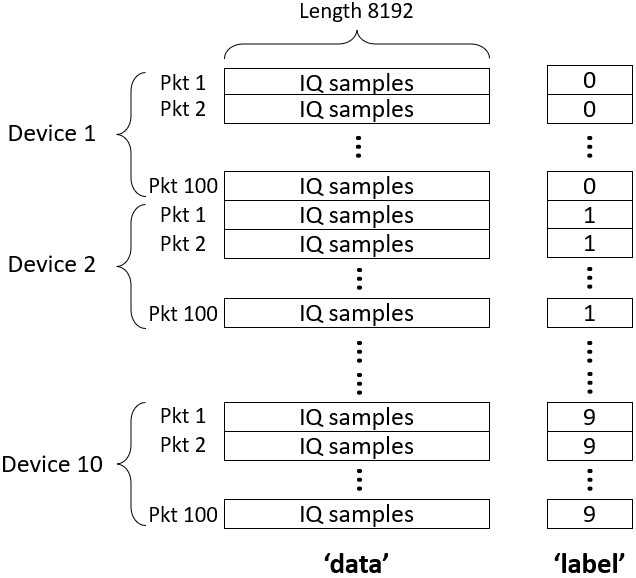

# README
This project builds a LoRa radio frequency fingerprint identification (RFFI) system based on deep learning techiniques. A dataset containing signals collected from 60 LoRa devices is also provided.  The detailed collection settings for the different sub-datasets can be found in Section [Dataset Introduction](#jump1). The section of [Code Example](#jump2) introduces the usage of some important functions, for more detailed usage please read the code comments carefully.

## Citation

If the part of the dataset/codes contributes to your project, please cite:

```
[1] G. Shen, J. Zhang, A. Marshall, and J. Cavallaro.   “Towards Scalable and Channel-Robust Radio Frequency 
Fingerprint Identification for LoRa,” IEEE Trans. Inf. Forensics Security, 2022.
```

```
@article{shen2021towards,
  title={Towards Scalable and Channel-Robust Radio Frequency Fingerprint Identification for LoRa},
  author={Shen, Guanxiong and Zhang, Junqing and Marshall, Alan and Cavallaro, Joseph},
  journal={IEEE Trans. Inf. Forensics Security},
  year={2021}
}
```

## Dataset Introduction 

<span id="jump1"></span>

### Experimental Devices

There are 60 commercial-off-the-shelf LoRa devices (LoPy4, mbed SX1261 shields, FiPy, Dragino SX1276 shields) included in the experiments. The table below provides more details of them.

| Device index | Model                 | Chipset |
| ------------ | --------------------- | ------- |
| 1 - 45       | Pycom LoPy4           | SX1276  |
| 46 - 50      | mbed SX1261 shield    | SX1261  |
| 51 - 55      | Pycom FiPy            | SX1272  |
| 56 - 60      | Dragino SX1276 shield | SX1276  |

All the LoRa packets are captured by a USRP N210 software-defined radio (SDR).

### Dataset Structure

The dataset consists of 26 sub-datasets, each of which is an HDF5 file. Each HDF5 file contains a number of LoRa signals (IQ samples of preamble part) and corresponding device labels. As HDF5 does not support complex numbers, we concatenate the signal I-brach (real part) and Q-branch (imaginary part) and then save it. Figure below shows the structure of the raw HDF5 dataset.


### Training Datasets

The following table summarizes the basic information of each training dataset. All the training datasets were collected in a residential room with a line of sight (LOS) between the transmitter and receiver.


| Training dataset path                     | Devices | Number of packets per device | Augmentation                       |
| ----------------------------------------- | ------- | ---------------------------- | ---------------------------------- |
| Dataset/Train/dataset_training_aug.h5     | 1 - 30  | 1,000                        | Yes, both multipath & Doppler      |
| Dataset/Train/dataset_training_aug_0hz.h5 | 1 - 30  | 1,000                        | Yes, only multipath ($f_d$ = 0 Hz) |
| Dataset/Train/dataset_training_no_aug.h5  | 1 - 30  | 500                          | No                                 |


### Test/Enrollment Datasets

The test/enrollment datasets were collected in a residential room, an office building and a meeting room. The floor plan is provided in the following figure:


The following table summarizes the basic information of each test/enrollment dataset.

| Test dataset path                                   | Devices | Number of packets per device | Collection env.                                |
| --------------------------------------------------- | ------- | ---------------------------- | ---------------------------------------------- |
| Dataset/Test/dataset_seen_devices.h5                | 1 - 30  | 400                          | Residential room, LOS, stationary              |
| Dataset/Test/dataset_rogue.h5                       | 41 - 45 | 200                          | Residential room, LOS, stationary              |
| Dataset/Test/dataset_residential.h5                 | 31 - 40 | 400                          | Residential room, LOS, stationary              |
| Dataset/Test/dataset_other_device_type.h5           | 46 - 60 | 400                          | Residential room, LOS, stationary              |
| Dataset/Test/channel_problem/A.h5                   | 31 - 40 | 200                          | Location A, LOS, stationary                    |
| Dataset/Test/channel_problem/B.h5                   | 31 - 40 | 200                          | Location B, LOS, stationary                    |
| Dataset/Test/channel_problem/C.h5                   | 31 - 40 | 200                          | Location C, LOS, stationary                    |
| Dataset/Test/channel_problem/D.h5                   | 31 - 40 | 200                          | Location D, NLOS, stationary                   |
| Dataset/Test/channel_problem/E.h5                   | 31 - 40 | 200                          | Location E, NLOS, stationary                   |
| Dataset/Test/channel_problem/F.h5                   | 31 - 40 | 200                          | Location F, NLOS, stationary                   |
| Dataset/Test/channel_problem/B_walk.h5              | 31 - 40 | 200                          | Location B, LOS, object moving                 |
| Dataset/Test/channel_problem/F_walk.h5              | 31 - 40 | 200                          | Location F, NLOS, object moving                |
| Dataset/Test/channel_problem/moving_office.h5       | 31 - 40 | 200                          | LOS, mobile in the office                      |
| Dataset/Test/channel_problem/moving_meeting_room.h5 | 31 - 40 | 200                          | NLOS, mobile in the meeting room               |
| Dataset/Test/channel_problem/B_antenna.h5           | 31 - 40 | 200                          | Location B, LOS, stationary, parallel antenna  |
| Dataset/Test/channel_problem/F_antenna.h5           | 31 - 40 | 200                          | Location F, NLOS, stationary, parallel antenna |

## Code Example
<span id="jump2"></span>

### 1. Before Start

#### a) Install Required Packages

Please find the 'requirement.txt' file to install the required packages.

#### b) Download Dataset

Please downlaod the dataset and put it in the project folder. The download link is https://ieee-dataport.org/open-access/lorarffidataset.

#### c) Operating System

This project is built entirely on the Windows operating system. There may be unexpected issues on other operating systems.


### 2. Quick Start
After installing packages of correct versions and downloading the datasets, you can directly run the 'main.py' file for RFF extractor training/rogue device detection/classification tasks. You can change the variable 'run_for' in line 364 to specify which task to perform. For example, the program will train an RFF extractor and save it if you set the 'run_for' as 'Train'.

### 3. Load Datasets

It is recommended to use our provided 'LoadDataset' class function to load the raw HDF5 files. You need to specify the dataset path, device range, and packet range before running it. Below is an example of loading an HDF5 file:
```python
import numpy as np
from dataset_preparation import LoadDataset

LoadDatasetObj = LoadDataset()
data, label = LoadDatasetObj.load_iq_samples(file_path = './dataset/Train/dataset_training_aug.h5', 
                                             dev_range = np.arange(0,30, dtype = int), 
                                             pkt_range= np.arange(0,100, dtype = int))
```
This example will extract ($10\times100=1000$) LoRa signals in total. More specifically, it will extract 100 packets from each device in range. The function 'load_iq_samples' returns two arrays, data and label. The data is a complex128 array of size (1000,8192), and label is an int32 array of size (1000,1). The figure below illustrates the structures of the two arrays.



<font color="#dd0000">Note that the loaded labels start from 0 but not 1 to adapt to deep learning. In other words, device 1 is labelled 0 and device 2 is labelled 1 and so forth.</font> 


### 4. Generate Channel Independent Spectrograms
The channel independent spectrogram helps mitigate the channel effects in the received signal and make LoRa-RFFI systems more robust to channel variations. We provide functions to convert an array of IQ samples to channel independent spectrograms. The following code block gives an example:

```python
from dataset_preparation import ChannelIndSpectrogram

ChannelIndSpectrogramObj = ChannelIndSpectrogram()
# The input 'data' is the loaded IQ samples in the last example.
ch_ind_spec = ChannelIndSpectrogramObj.channel_ind_spectrogram(data)
```
The returned 'ch_ind_spec' is an array of size (1000,102,62,1). Note that the size of the array is affected by the STFT parameters, which can be changed in code. Please refer to our paper or code comments to find the detailed derivation of channel independent spectrograms.

### 5. Train an RFF Extractor
The function 'train_feature_extractor()' can train an RFF extractor using triplet loss. 
```python
import numpy as np
from deep_learning_models import TripletNet, identity_loss
from sklearn.model_selection import train_test_split
from keras.callbacks import EarlyStopping, ReduceLROnPlateau
from keras.optimizers import RMSprop

feature_extractor = train_feature_extractor()
```
You can also specify the training dataset path, training device range, training packets range and SNR range during augmentation. Otherwise, the default values will be used. Following is an example:

```python
feature_extractor = train_feature_extractor(file_path = './dataset/Train/dataset_training_aug.h5', 
                                            dev_range = np.arange(0,10, dtype = int), 
                                            pkt_range = np.arange(0,1000, dtype = int), 
                                            snr_range = np.arange(20,80)):
```

### 6. Rogue Device Detection
The function 'test_rogue_device_detection()' performs the rogue device detection task. You MUST specify the RFF extractor path before running the function. See the example below:

```python
import numpy as np
from sklearn.neighbors import KNeighborsClassifier
from sklearn.metrics import roc_curve, auc

fpr, tpr, roc_auc, eer = test_rogue_device_detection('./models/Extractor_1.h5')
```
This function returns false posive rate (FPR), true positive rate (TPR), area under the curve (AUC) and equal error rate (EER). These are all important evaluation metrics in rogue device detection task. Please refer to our paper for their definitions.

The following lines of code plot the ROC curve using the returned results:

```python
import matplotlib.pyplot as plt

# Plot the ROC curves.
plt.figure(figsize=(4.8, 2.8))
plt.xlim(-0.01, 1.02)
plt.ylim(-0.01, 1.02)
plt.plot([0, 1], [0, 1], 'k--')
plt.plot(fpr, tpr, label='Extractor 1, AUC = ' 
         + str(round(roc_auc,3)) + ', EER = ' + str(round(eer,3)), C='r')
plt.xlabel('False positive rate')
plt.ylabel('True positive rate')
plt.title('ROC curve')
plt.legend(loc=4)
# plt.savefig('roc_curve.pdf',bbox_inches='tight')
plt.show()    
```

### 7. Classification
The function 'test_classification()' performs the classification task. You MUST specify the paths of enrollment dataset, test dataset and RFF extractor before running the function. Here is a simple example:

```python
from sklearn.metrics import accuracy_score
from sklearn.neighbors import KNeighborsClassifier
import numpy as np

pred_label, true_label, acc = test_classification(file_path_enrol = 
                                                  './dataset/Test/dataset_residential.h5',
                                                  file_path_clf = 
                                                  './dataset/Test/channel_problem/A.h5',
                                                  feature_extractor_name = 
                                                  './models/Extractor_1.h5')
```
This example returns predicted labels, true labels and the overall classification accuracy. We can further plot a confusion matrix to see fine-grained classification results:

```python
import matplotlib.pyplot as plt
import seaborn as sns

# Plot the confusion matrix.
conf_mat = confusion_matrix(true_label, pred_label)
classes = test_dev_range + 1 # xticklabels

plt.figure()
sns.heatmap(conf_mat, annot=True, 
            fmt = 'd', cmap='Blues',
            cbar = False,
            xticklabels=classes, 
            yticklabels=classes)
plt.xlabel('Predicted label', fontsize = 20)
plt.ylabel('True label', fontsize = 20)
```


## License
The dataset and code is licensed under a Creative Commons Attribution-NonCommercial-ShareAlike 4.0 International License.

## Contact
Please contact the following email addresses if you have any questions:  
gxshen AT seu.edu.cn <br>
Junqing.Zhang AT liverpool.ac.uk
